# SIEM & Detection Engineering Lab
**Wazuh + Splunk Enterprise + Sysmon | MITRE ATT&CK-Mapped Detections**

---

## Objective
This lab demonstrates the design and implementation of a complete endpoint detection pipeline. Wazuh was deployed as the primary SIEM for alerting and MITRE ATT&CK mapping, with Splunk used for centralized log ingestion, correlation, and visualization.

---

## Architecture

This environment simulates a small SOC setup with a Wazuh manager, Splunk server, and both Linux and Windows endpoints. All systems communicate over a bridged network to mimic real enterprise visibility.

**VM Specifications**  
 |   
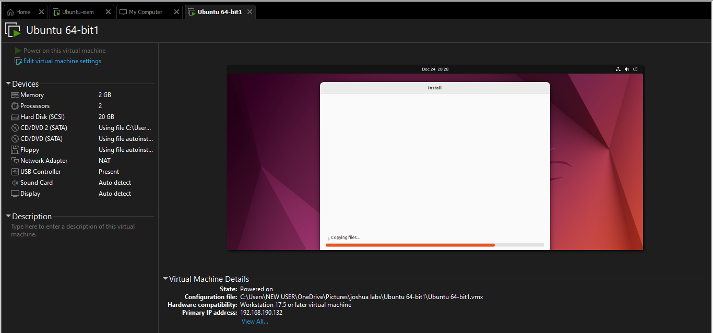 | 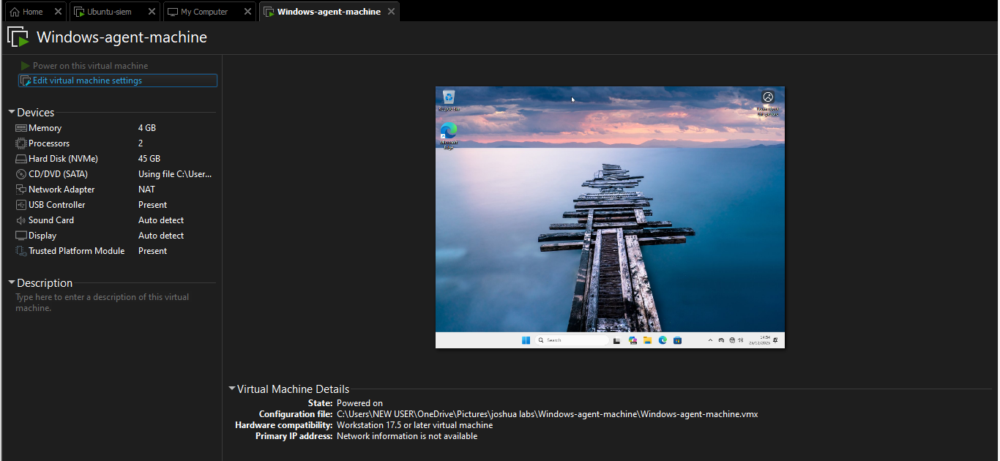

---

## Wazuh Setup
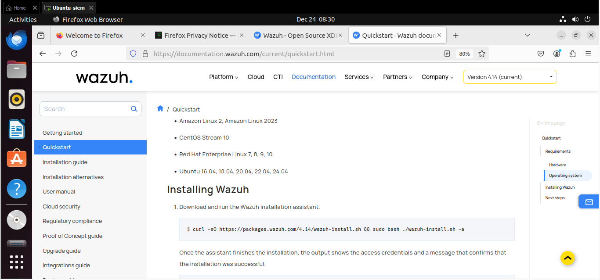  
  
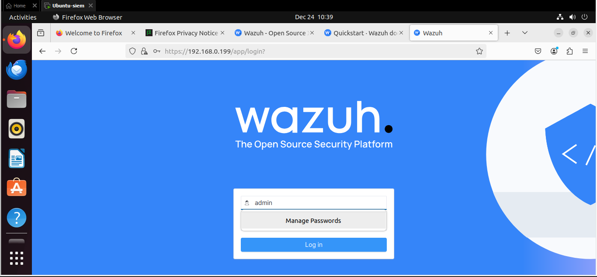  

Wazuh was installed using the official installation script and verified via terminal output and dashboard access. Initial dashboard state confirms a clean deployment prior to agent onboarding and alert generation.

---

## Splunk Integration (Universal Forwarder)
  
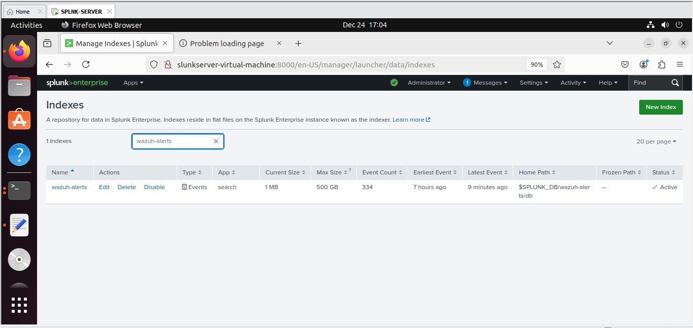  
  
  
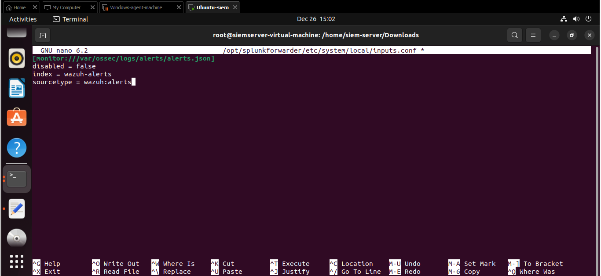

Splunk Enterprise was configured to receive logs from Wazuh via the Universal Forwarder. Wazuh alerts were forwarded in real time from `alerts.json` into a dedicated `wazuh-alerts` index, enabling centralized analysis and dashboarding.

---

## Agent Deployment

### Linux Agent
  
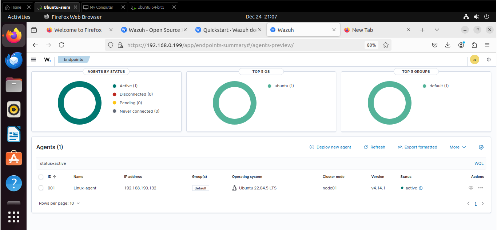

The Linux endpoint was onboarded using the Wazuh agent deployment command. Successful connection confirmed secure communication between the agent and the Wazuh manager.

### Windows Agent + Sysmon
  
  

A Windows endpoint was deployed with the Wazuh agent and enhanced telemetry using Sysmon. This provided high-fidelity process, authentication, and account activity logs for detection engineering.

---

## Detected MITRE ATT&CK Techniques

### Linux Detections

#### **T1136 – Create Account**
  
  

A new local user account was created on the Linux host. Wazuh detected the account creation event, mapped it to MITRE T1136, and forwarded the alert to Splunk with matching timestamp and context.

---

#### **T1053.003 – Scheduled Task (Cron)**
  
  

A malicious cron job was added to simulate persistence via scheduled tasks. The activity was detected by Wazuh and accurately classified under MITRE T1053.003, then correlated in Splunk.

---

#### **T1548.003 – Privilege Escalation (Sudo Caching)**
  
  

Privilege escalation was simulated using repeated sudo execution. Wazuh flagged the behavior as T1548.003 and forwarded the alert to Splunk, maintaining full MITRE and timestamp integrity.

---

#### **T1110.001 – Brute Force (Password Guessing)**
  
  

Multiple failed authentication attempts were generated to simulate a brute-force attack. Wazuh detected the repeated failures and mapped the activity to MITRE T1110.001, with identical events visible in Splunk.

---

### Windows Detections (with Sysmon)

#### **T1078 – Valid Accounts**
  
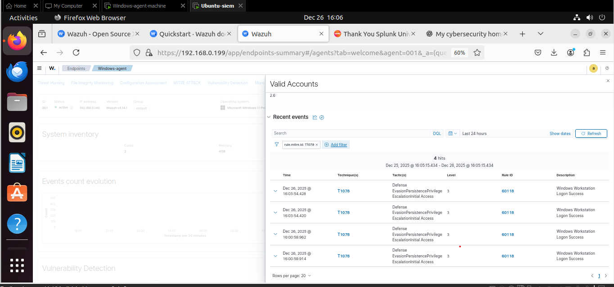  
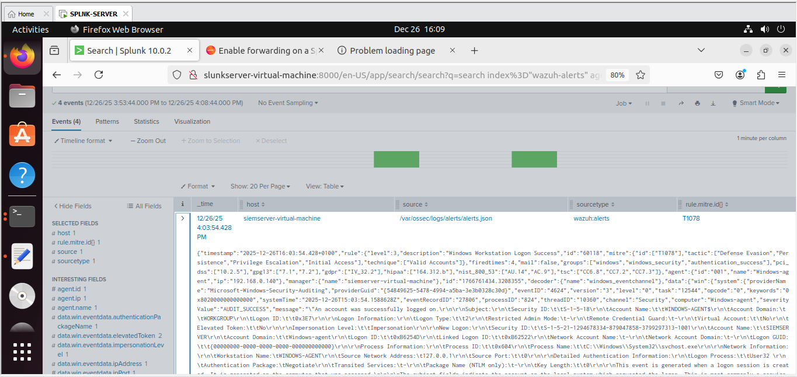

A legitimate account was used in a suspicious context to simulate abuse of valid credentials. The event was detected by Wazuh and mapped to T1078, then forwarded to Splunk for correlation.

---

#### **T1484 – Domain / Policy Modification**
  
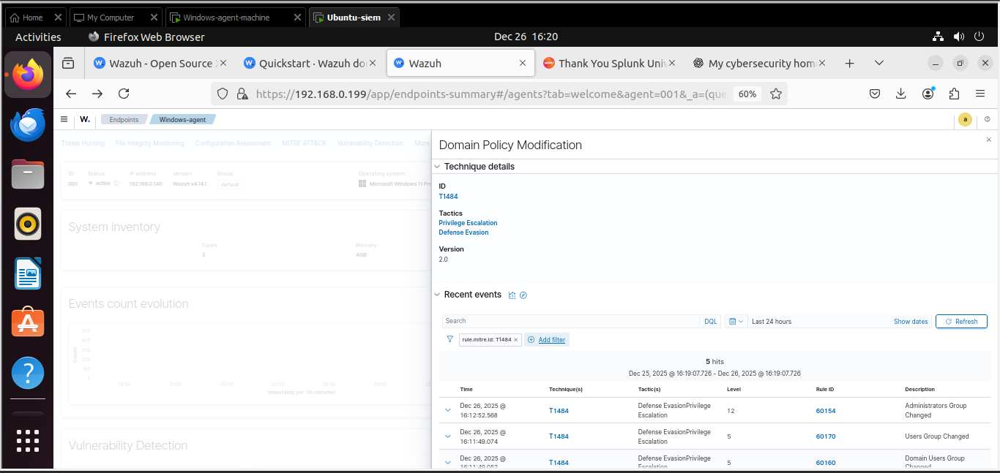  

Security policy modification was simulated on the Windows host. Wazuh detected the change and correctly classified it as MITRE T1484, with consistent visibility in Splunk.

---

#### **T1531 – Account Manipulation**
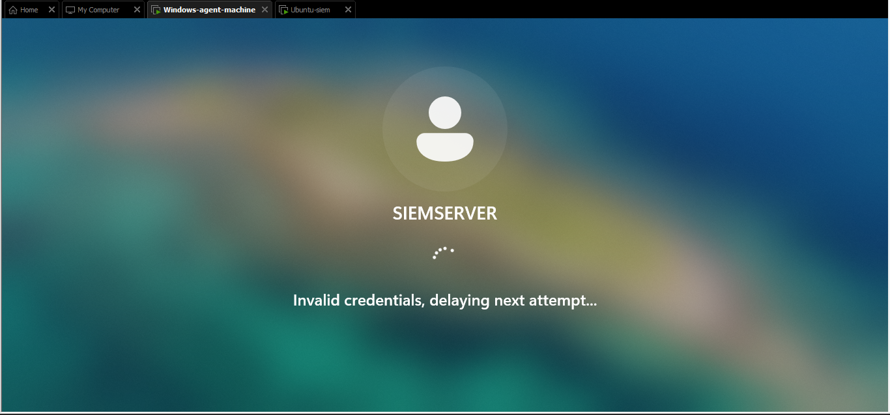  
  

User account changes were performed to simulate account manipulation. The activity was detected, MITRE-mapped to T1531, and confirmed in Splunk with identical alert data.

---

## Custom Splunk Dashboard
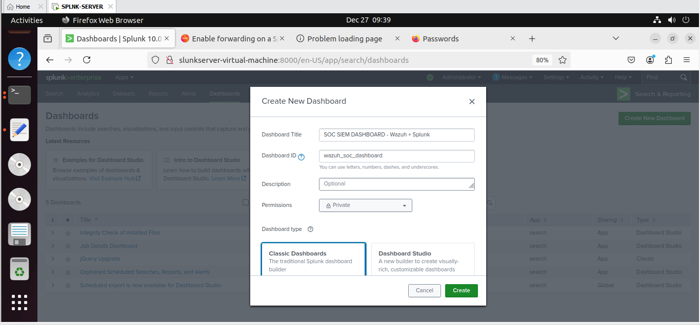

A custom SOC-focused dashboard was built to visualize Wazuh alerts ingested into Splunk.

**Key Panels**
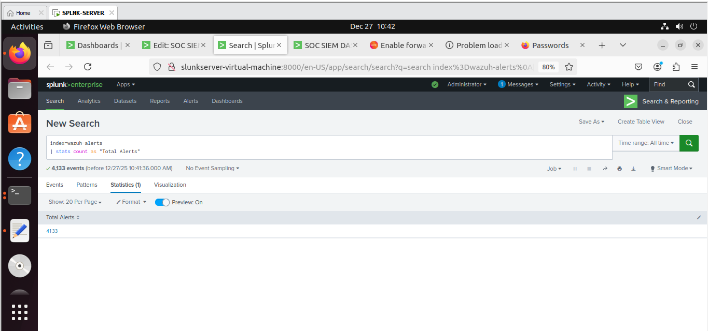  
Displays the total number of security alerts ingested from Wazuh.

  
Breaks down alerts by MITRE ATT&CK technique to highlight attacker behavior patterns.

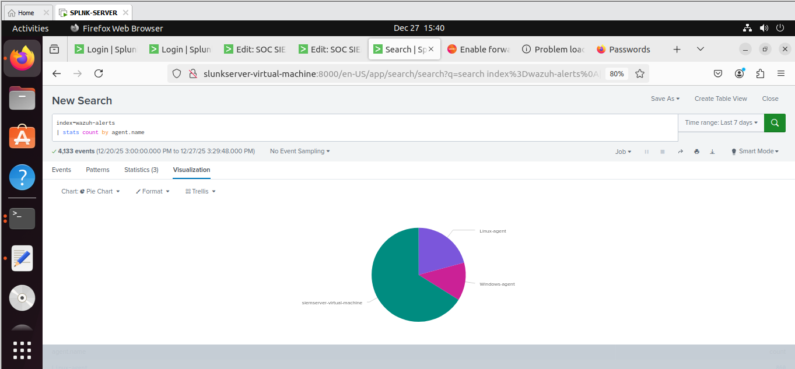  
Shows alert distribution across Linux and Windows endpoints.

  
Provides a live SOC-style table for triage and investigation.

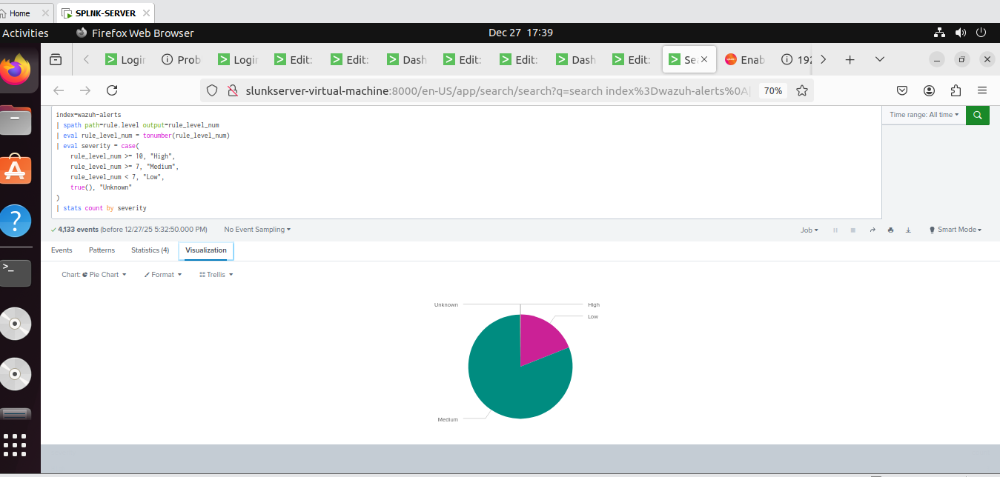  
Visualizes alert severity to prioritize analyst response.

---

## Challenges & Learnings
- Rebuilt Wazuh after API-related issues, strengthening troubleshooting skills
- Implemented real-time log forwarding using Splunk Universal Forwarder
- Achieved exact correlation across command execution, Wazuh alerts, and Splunk events
- Designed a SOC-ready dashboard using SPL for operational visibility

This lab demonstrates hands-on experience in SIEM deployment, detection engineering, endpoint telemetry, MITRE ATT&CK mapping, and SOC-level visualization.
